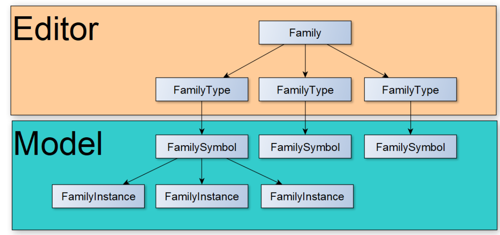

# Общие сведения и правила работы с Семействами

В терминологии Revit на первом уровне классификации компонентов Цифровой информационной модели (ЦИМ) выделяются:

* Системные Семейства (**system families**) — встроенные в логику программы и создаваемые **только в файле проекта** Revit (формат **.rvt**)
* Загружаемые Семейства (**loadable families**) — создаются средствами Редактора Семейств и загружаются в файл проекта Revit, могут сохранятся в отдельные файлы (формат **.rfa**)
* Контекстные Семейства (**in-place**) — компоненты, размещаемые как элементы и создаваемые **только в файле проекта** Revit (формат **.rvt**), **без возможности повторного применения**!

В соответствии с [концепцией ООП](https://ru.wikipedia.org/wiki/%D0%9E%D0%B1%D1%8A%D0%B5%D0%BA%D1%82%D0%BD%D0%BE-%D0%BE%D1%80%D0%B8%D0%B5%D0%BD%D1%82%D0%B8%D1%80%D0%BE%D0%B2%D0%B0%D0%BD%D0%BD%D0%BE%D0%B5\_%D0%BF%D1%80%D0%BE%D0%B3%D1%80%D0%B0%D0%BC%D0%BC%D0%B8%D1%80%D0%BE%D0%B2%D0%B0%D0%BD%D0%B8%D0%B5), заложенной в логику программы Revit, Типоразмеры (FamilyType's) и родительский класс Семейства Family являются [Компонентами](../../../CH00\_Intro/defenitions.md#komponent-cim) Цифровой информационной модели (ЦИМ), а их экземпляры (FamilyInstance's), размещённые в пространстве модели непосредственно — [Элементами ЦИМ](../../../CH00\_Intro/defenitions.md#element-cim).

## Именование семейств

1. При формировании наименования Семейств применяются принципы, описанные в соглашении по именованию
2. Для **вложенных семейств**, которые являются дочерними по отношению к другим семействам и загружены внутрь родительского Семейства в его редакторе (детали, фурнитура и т.п.), применяется специальный символ Юникода <mark style="color:orange;background-color:orange;">`›`</mark> (комбинация клавиш Alt+0155 на Windows или скопируйте здесь), прописываемый **перед** принятыми по соглашению полями.\
    \
   Символ позволяет сортировать вложенные семейства и избежать ошибок, когда поставлена задача **не допускать размещение в модели** экземпляров таких семейств: при его применении вложенные семейства попадают в конец (нижнюю часть) списка каждой категории
